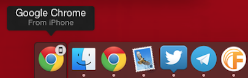

# iOS Handoff Sample App

This sample app demonstrates how to use Handoff introduced in iOS 8 and supported by Titanium 5.0. Handoff lets you start using an application, such as editing a document, on one device, then transfer to another device to continue working on it.

## Handoff Guide

For the complete details on how exactly Handoff works and how you can implement it in Titanium 5.0, check our guide: [Handoff User Activities](https://appcelerator.github.io/appc-docs/latest/#!/guide/Handoff_User_Activities).

## Handoff scenarios

Handoff is not just about continuity between two identical apps on two iOS devices. There are many other scenarios, including handoff between an Native App and Web Browser where *Native App* can be either an iOS or Max OS X App.

1. [Handoff Native App to Native app](https://developer.apple.com/library/ios/documentation/UserExperience/Conceptual/Handoff/AdoptingHandoff/AdoptingHandoff.html#//apple_ref/doc/uid/TP40014338-CH2-SW3)
2. [Handoff Native App to Web Browser](https://developer.apple.com/library/ios/documentation/UserExperience/Conceptual/Handoff/AdoptingHandoff/AdoptingHandoff.html#//apple_ref/doc/uid/TP40014338-CH2-SW21)
3. [Handoff Web Browser to Native App](https://developer.apple.com/library/ios/documentation/UserExperience/Conceptual/Handoff/AdoptingHandoff/AdoptingHandoff.html#//apple_ref/doc/uid/TP40014338-CH2-SW10)
4. [Handoff Apple Watch App to Native App or Web Browser](https://developer.apple.com/library/ios/documentation/General/Conceptual/WatchKitProgrammingGuide/iOSSupport.html)
5. [Handoff Apple Watch Glance to Apple Watch App](https://developer.apple.com/library/ios/documentation/General/Conceptual/WatchKitProgrammingGuide/TheGlanceController.html#//apple_ref/doc/uid/TP40014969-CH16-SW4)

This sample will cover scenarios 1, 2 and 4 for iOS Apps only. Follow the links for Apple guides on the other two scenarios.

## Handoff flowchart

They say a flowchart says more then 1000 lines of code:

The above figure shows how every time a change requires the activity state to be updated, its `needsSave` property must be set to `true`. It is then up to iOS when it will fire the `useractivitywillsave` event, but this should at least happen directly after you've called the activity's `becomeCurrent()` method and before it is handed off to another device. This allows you actually update the activity's `title`, `userInfo` and `webpageURL` properties. iOS will then fire the `continueactivity` event on the device that requested the Handoff, followed by `useractivitywascontinued` on the sending device. If your activity's state doesn't change while it is current, you only have to implement the `continueactivity` event.

## iOS App to iOS App

The [needsSave](app/controllers/needsSave.js) tab demonstrates the use of the `needsSave` property and `useractivitywillsave` event to update the activity state before it is handed off to the same iOS app on another device.

### Creating and invalidating the activity

Open the [view](app/views/needsSave.xml) to see that we create and call `becomeCurrent()` on the user activity when the window (tab) receives focus and invalidate the activity when it looses focus.

A short version of the [controller code](app/controllers/needsSave.js#L40) starting around line 40:

	activity = Ti.App.iOS.createUserActivity({
		activityType: 'com.appcelerator.sample.handoff.needssave',
		title: $.title.value,
		userInfo: {
			body: $.body.value
		}
	});
	
	activity.addEventListener('useractivitywillsave', onUseractivitywillsave);
	activity.addEventListener('useractivitywascontinued', onUseractivitywascontinued);

	if (activity.supported) {
		activity.becomeCurrent();
	}

The above code will publish your activity to all connected iOS and Mac OS X devices.

> **NOTE:** The activityType is usually a reverse company (if you handoff between different apps) or app domain plus a present continuous verb and needs to be registered in the [tiapp.xml](tiapp.xml#L20)'s `<ios><plist><dict>` section.
	
### Sending for Handoff
The two event listeners we added in the previous snippet are optional, but allow us to prepare our activity before it is handed off and handle stuff afterwards.

> **NOTE:** There is a [known issue](https://jira.appcelerator.org/browse/TIMOB-19567) that sometimes the updates in `useractivitywillsave` don't make it to the other device in time. To workaround (also) update the activity where you set `needsSave:true`.

You can find the related code starting at [line 100](app/controllers/needsSave.js#L100). You can change the activity's `title`, `userInfo` and `webpageURL` properties.

	function onUseractivitywillsave(e) {
		activity.title = $.title.value;
		activity.userInfo = {
			body: $.body.value
		};
	}

> **NOTE:** Just like `Ti.UI.View.font` you need to set the full `userInfo` object.

### Receiving a Handoff
On the other end we need to listen to the global `Ti.App.iOS:continueactivity` event which will fire for all continued actives as well when the user opens a Spotlight result for the app.

As you can see in the first lines of the [controller](app/controllers/needsSave.js) this means we have to check for the `activityType` we want to act on. In this case we we make our tab active and update the fields with the received activity state:

	Ti.App.iOS.addEventListener('continueactivity', onContinueactivity);
	
	function onContinueactivity(e) {

		if (e.activityType !== 'com.appcelerator.sample.handoff.needssave') {
			return;
		}
	
		$.tab.active = true;
	
		$.win.title = e.title || '(untitled)';
		$.title.value = e.title;
		$.body.value = e.userInfo.body;
	}

### Try it out!
To test this scenario, install the sample on two iOS devices that meet [Apple's requirements](https://support.apple.com/en-us/HT204681). Now change the fields on the first device. Then double tap home (iOS 9) or lock the other device to see the Handoff bar or icon appear. Tap it and the app should open and update the fields using the received activity state.

## iOS App to Web Browser
The [webpageURL](app/controllers/webpageURL.js) tab demonstrates the use of the `webpageURL` property to support Handoff from an iOS app to a Web Browser on another iOS or Mac OS X device.

Again, we create and invalidate a user activity in the same way as our previous tab. This time we don't use the `userInfo` and `needsSave` properties or the `useractivitywillsave` event because our activity state won't change.

We do set the `webpageURL` property to the GitHub URL for the controller's source code. We also listen to the `useractivitywascontinued` event to demonstrate that even when you continue an activity in a Web Browser the app will still be notified. the browser however will **not** receive any information on the activity so all information you need must be in the URL.

### Try it out!
To test this scenario, install the sample on an iOS device and navigate to the *webpageURL* tab. On other iOS devices that do not have the iOS app you should see the Handoff bar or icon appear. This time it will have the icon and name of your default browser - *Safari* on iOS. Tap it to open the URL.

On Mac OS X devices that meet [Apple's requirements](https://support.apple.com/en-us/HT204681) you should see the default browser's icon in a special Handoff extension to the Dock. A small icon indicates that it comes from an iOS device. Click to open the URL.

## Apple Watch App to iOS App or Web Browser
The [WatchApp](app/controllers/watch.js) tab and the bundled [WatchApp Extension](extensions/Handoff/Handoff WatchApp Extension/InterfaceController.m) demonstrates Handoff from an Apple Watch App to an iOS App or Web Browser on another iOS or Mac OS X device.

### Creating an activity in the WatchApp
This time we don't create an activity in the iOS app but in the bundled extension. Just use [Apple's reference](https://developer.apple.com/library/ios/documentation/WatchKit/Reference/WKInterfaceController_class/index.html#//apple_ref/occ/instm/WKInterfaceController/updateUserActivity:userInfo:webpageURL:) to create and invalidate an activity when the WatchApp activates and deactivates, as shown in our [InterfaceController](extensions/Handoff/Handoff WatchApp Extension/InterfaceController.m).

	- (void)willActivate {
	    [super willActivate];
	    
	    [self updateUserActivity:@"com.appcelerator.sample.handoff.watching"
	                    userInfo:@{@"foo":@"bar"}
	                  webpageURL:[NSURL URLWithString:@"https://github.com/appcelerator-developer-relations/appc-sample-handoff/blob/master/extensions/Handoff/Handoff%20WatchApp%20Extension/InterfaceController.m"]];
	}
	
	- (void)didDeactivate {
	    [super didDeactivate];
	    
	    [self invalidateUserActivity];
	}

> **NOTE:** I use Objective-C, but the reference shows you how to do it in Swift.

### Receiving the Handoff in the iOS App
All we do in the [watch.js](app/controllers/watch.js) controller is again listen to the global `Ti.App.iOS:continueactivity` event and check for the `activityType` that we've set in the WatchApp. In this case we simply log the payload and display a message.

### Receiving the Handoff in a Web Browser
The paired iOS device of course has the app installed, but any other iOS or Mac OS X device that meets [Apple's requirements](https://support.apple.com/en-us/HT204681) will be able to open the activity in the Web Browser because we've set the `webpageURL` to the source code of the interface controller on GitHub.

As you can see on the Mac the small icon now shows an Apple Watch:

## Links

* [Appcelerator Handoff User Activities Guide](http://docs.appcelerator.com/platform/latest/#!/guide/Handoff_User_Activities)
* [Apple Handoff Programming Guide](https://developer.apple.com/library/prerelease/ios/documentation/UserExperience/Conceptual/Handoff/HandoffFundamentals/HandoffFundamentals.html)